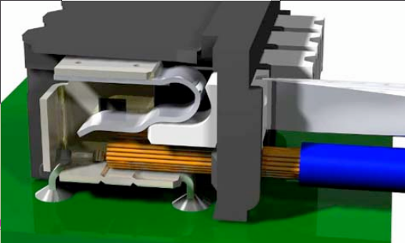

# RoboRIO

The RoboRIO is like the brain of an FRC robot. It is the main processing unit where the code is stored and run. The roboRIO has a basic architecture of a real-time processor and field-programmable gate array but is powerful, smaller, and lighter than the previous system FRC has developed.

The robotRIO includes built-in ports for inter-integrated circuits(I2C), serial peripheral interfaces(SPI), RS232, USB, Ethernet, pulse width modulation(PWM), and relays to quickly connect the common sensors and actuator used in robotics.

## Wiring

### Connectors

Weidmuller connectors are used to supply power to the RoboRIO, PCM (Pneumatic Control Module, and VRM (Voltage Regulator Module). Older revisions of the PDP also utilized a version of this connector. These connectors work by lodging an awl/screwdriver head into the designated indent, and pushing down, enabling the slot for the wire to open up. Releasing the pressure on the indent will tighten up against the wire.

### Wiring Diagram

Below is a wiring diagram for the RoboRIO

1) Digital Input/Output(DIO): used for certain digital sensors. Ex: limit switches or encoders. 
2) R2-232
3) I2C port: Can be used with one of the NAVX gyros
4) CAN Port (Controller Area Network): used to power/signal TalsonSRX’s, the pneumatics control module, and the power distribution panel
5) Input Power: The robotRIO gets wired to the power distribution panel and is not connected directly to the robot battery. 
6) USB device port: provide a way for your device to interface with the robotRIO (for loading code or driving robot) It is more reliable than the ethernet connection.
7) USB Host Retention Mount: used for securing USB devices plugged into the RIO (ex. camera)
8) USB Host ports: used for interfacing the robotRIO with USB devices (ex. Camera, NAVX gyro)
9) Ethernet port: used for communication with wireless mesh radio or interfacing with your device(through an ethernet cord)
10) Serial peripheral interface(SPI) bus: used for interfacing with certain sensors like gyro.
11) LEDs for status
18. The robot signal light(RSL): is mandatory during competitions and acts as a signal to whether the robot is connected in teleop mode(Driver Controlled period), etc… 
    
