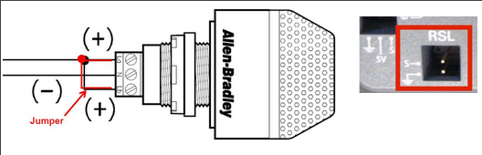

# Robot Safety Light (RSL)

The RSL is a safety light to indicate when the robot is in use

## RSL Codes

| Light Code                        | Meaning                                                                                                                             |
|-----------------------------------|-------------------------------------------------------------------------------------------------------------------------------------|
| Solid ON                          | Autonomous enabled                                                                                                                  |
| Solid On —- blinks off every 1.5s | Teleop enabled                                                                                                                      |
| Slow Blink                        | System disabled by system watchdog, user watchdog, or driver station set to disabled                                                |
| Fast-Slow blink                   | Low battery (<12V) or no user code and system disabled either by system watchdog, user watchdog, or driver station set to disabled. |
| Fast Blink                        | System error; No driver station communication; communication errors.                                                                |

## Wiring

A separate wire acts as a jumper between La and Lb. connect La to S on the robotRIO and N to Ground on the robotRIO

